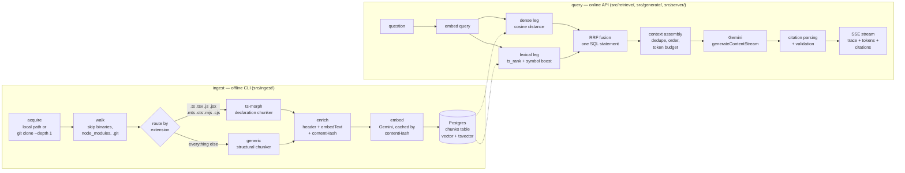
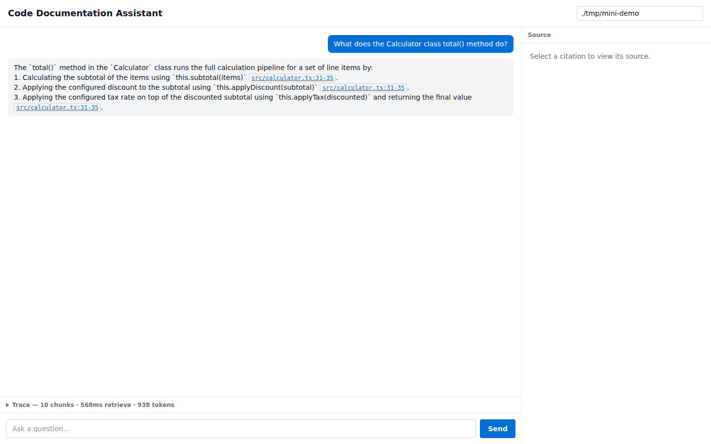
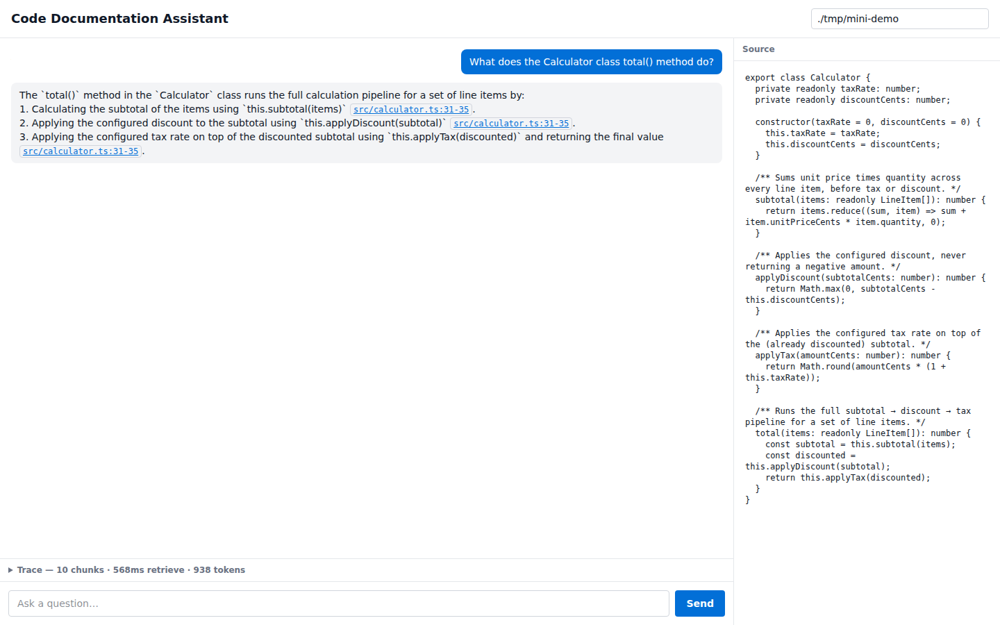
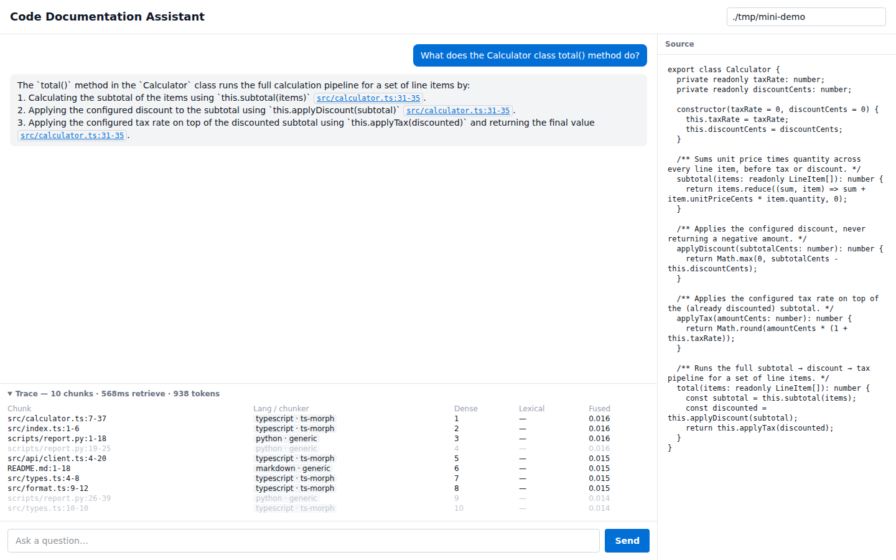

# Code Documentation Assistant

RAG over source repositories. Point it at a local path or a public GitHub URL and ask questions
about the code, cited back to `file:line`. TypeScript and JavaScript get AST-level chunking via
ts-morph — real declaration boundaries, signatures, JSDoc, exported status. Every other language
gets a generic structural chunker that produces the same shape of chunk with the same enrichment
header, honestly leaving `signature` and `jsDoc` null rather than inventing them. The claim is
"chat with any codebase, optimised for TypeScript/JavaScript" — not TypeScript-only, and not a
five-language parser matrix that doesn't exist.

**Demo corpora indexed for the screenshots below:**
- **TS/JS, local path:** [`./tmp/mini-demo`](./tmp/mini-demo) — a small hand-authored fixture (9
  files: a class with a constructor, a JSDoc'd function, an interface and a type alias, a mix of
  exported and private helpers, an async client method, a barrel re-export, and one Python
  script) built specifically to exercise every chunk shape while staying well under Gemini's
  free-tier daily quota. 13 chunks — 8 via ts-morph across the 5 `.ts` files, 5 via the generic
  chunker across `report.py`, `README.md` and `package.json`.
- **TS/JS, public GitHub URL:** [`sindresorhus/is-plain-obj`](https://github.com/sindresorhus/is-plain-obj),
  commit `97f38e8836f86a642cce98fc6ab3058bc36df181` — ingested with
  `--repo https://github.com/sindresorhus/is-plain-obj` and nothing pre-staged in `./tmp/`; the
  CLI shallow-clones it itself. 20 chunks: 7 via ts-morph (`index.js`, `index.d.ts`,
  `index.test-d.ts`, `benchmark.js`, `test.js`), 13 via generic (`readme.md`, `package.json`,
  `.github/funding.yml`). Exists specifically to prove the URL path end-to-end rather than only
  describe it — see the fourth screenshot below.
- **Non-TS:** [`pypa/sampleproject`](https://github.com/pypa/sampleproject),
  commit `621e4974ca25ce531773def586ba3ed8e736b3fc` — a real public Python package, also ingested
  by URL, entirely through the generic path: 29 chunks across `.py`, `.toml`, `.yaml` and `.md`.
- [`honojs/hono`](https://github.com/honojs/hono) was cloned and run through the ts-morph chunker
  during development to stress-test it against a real, larger TypeScript codebase (2,188 chunks
  across 388 files) — see [Chunking](#chunking) and [Known limitations](#known-limitations) for
  what that run found. It was never embedded into Postgres — too large to query comfortably
  inside the free tier, which is exactly why `mini-demo` and `is-plain-obj` exist as the two
  small corpora actually queried for the screenshots.

---

## Quick start

```bash
git clone <repo>
cd <repo>
cp .env.example .env      # set GEMINI_API_KEY
docker compose up         # db healthy -> migrations applied -> app builds & serves API + UI
docker compose exec app node dist/ingest/cli.js --repo https://github.com/honojs/hono
open http://localhost:8080
```

**Requires:** Node 24.18.0 (pinned in `.mise.toml`) if you're running outside Docker · Docker
Compose · one Gemini API key — free, no credit card, from aistudio.google.com. That one key
covers both embedding and generation; no separate OpenAI or Anthropic key is used anywhere in
this project.

One command, one port, three stages gated in order: `docker compose up` waits for Postgres to
report healthy, runs `node-pg-migrate` to completion as a one-shot `migrate` service
(`depends_on: condition: service_completed_successfully`), and only then starts `app` — which
serves the API **and** the built React client from the same process on `:8080`. There's no
separate UI container or port to remember: `npm run build` compiles both halves (`tsc` for the
server, `vite build` for the client) into one `dist/`, and `src/server/app.ts` serves `dist/web/`
as static files with an SPA fallback, mounted after every API route so `/health`, `/ready`,
`/api/chat` and `/api/source` keep taking priority. Ingestion is deliberately **not** a compose
service: it's a one-off command you run after the stack is up, shown above. `npm run ingest`
itself isn't used inside the container — that script's `node --env-file=.env` expects a literal
`.env` file, which doesn't exist in a container where compose injects env vars directly;
`docker-compose.yml` documents the `node dist/ingest/cli.js` equivalent at the top of the file.

**Repo sources:** a local directory path, or a public GitHub HTTPS URL, shallow-cloned
(`--depth 1`) into `./tmp/`. No SSH, no tokens — pointing this at a private repo means using the
local-path mode, not building a credential story.

**Local (non-Docker) development**, for reference — this is how the project itself was built and
is closer to what `CLAUDE.md` documents:

```bash
npm ci
npm run migrate                                 # schema is migration-based, never created at boot
npm run ingest -- --repo ./tmp/mini-demo        # or any local path / GitHub URL
npm run serve       # API on :8080
npm run dev:web      # Vite on :5173, proxies /api to :8080
```

---

## Architecture

Two paths, kept deliberately separate — nothing in `src/retrieve/` may import from `src/ingest/`:



**Ingest** (`src/ingest/`) is a separate CLI process — `npm run ingest`, never a request handler.
ts-morph parsing is synchronous CPU work, and so, more cheaply, is the generic chunker's brace
scanner; running either inline in Express would freeze every SSE stream in flight for as long as
a repo took to chunk. The router (`src/ingest/classify.ts` + `src/ingest/chunkers/index.ts`) is
one small, explicit piece: extension → language is a pure table with no chunker knowledge, and an
ordered registry of `Chunker` implementations picks the first one whose `supports()` returns
true, with the generic chunker last and unconditional so the registry is total by construction.
Nothing in the pipeline branches on which chunker produced a `Chunk` — the field exists only as a
label (`chunkerKind`) for the trace panel.

**Query** (`src/retrieve/`, `src/generate/`, `src/server/`) runs one dense leg and one lexical leg
against `chunks`, fuses them with reciprocal rank fusion inside a single SQL statement, assembles
a token-budgeted context from the fused results, streams a cited answer from Gemini over SSE, and
validates every citation against the ranges actually shown to the model. Retrieval is
language-agnostic by the time a chunk reaches the index — it's text plus metadata, and nothing
downstream cares which chunker produced it, which is what makes adding a third chunker later
additive instead of a rewrite.

One Postgres container, one app container (`docker-compose.yml`), ingest run as a one-off exec
inside the app container rather than a service of its own.

**Stack:** TypeScript (strict, ESM, `nodenext`) · Node 24.18.0 · Express 5 · React 19 + Vite 8 +
Tailwind v4 · Postgres 16 + **pgvector 0.8.6** · ts-morph 28 · Gemini `gemini-embedding-2` (768d)
· `gemini-3.6-flash`

pgvector 0.8.6 is named explicitly because it matters: 0.8.x has HNSW indexing, `halfvec`, and
iterative index scans that older builds lack, and the shipped compose file pins
`pgvector/pgvector:0.8.6-pg16` — not the floating `pg16` tag — so a grader gets the same index
behaviour this was measured against rather than a silently different one.

---

## Chunking

This is the section that differentiates the project, so here's what naive splitting actually
produces, on a real file from the demo corpus. `src/calculator.ts`'s `Calculator` class is 31
lines, JSDoc included. A fixed-size character splitter with no AST awareness, cutting every 300
characters with no regard for syntax, lands its second chunk here:

```
 = 0, discountCents = 0) {
    this.taxRate = taxRate;
    this.discountCents = discountCents;
  }

  /** Sums unit price times quantity across every line item, before tax or discount. */
  subtotal(items: readonly LineItem[]): number {
```

No class name, no method name for the constructor it starts mid-parameter-list inside, and no
signature — it's the back half of `constructor(taxRate` (cut in the *previous* chunk) fused to the
front half of `subtotal()`. It's unmatchable by a symbol-name search for either method and still
fully retrievable by a vector search, since it embeds like real code — the worst combination,
because nothing about the chunk signals that it's unreliable.

Compare the two chunk shapes this project actually produces, from the same `mini-demo` corpus:

**ts-morph** (`src/calculator.ts`, `kind: 'class'`):
```
symbolName: Calculator
signature: class Calculator
jsDoc: "Computes order totals from a list of line items, applying an optional flat-rate
        tax and a fixed discount in cents."
startLine: 7, endLine: 37
```
Real declaration boundaries, a real signature composed from ts-morph's `getStructure()` fields
(not `getText()`, which drags the full body into what should be a one-line signature), and the
class's own JSDoc.

**generic** (`scripts/report.py`, `kind: 'block'`):
```
symbolName: report_summary   (best-effort, from a def-shaped first line)
signature: null
jsDoc: null
startLine: 19, endLine: 25
```
Same enrichment header, same `Chunk` shape, but `signature` and `jsDoc` are hard-coded null. The
generic chunker is a brace/indent-aware block splitter — it knows where a block starts and ends,
not what a function's type signature is — and inventing one would be a lie the citation validator
downstream has no way to catch. The honest null is the whole point of the two-tier design.

**Why two tiers, not one, and not five.** The implementation language (TypeScript) and the
languages this tool can *index* are independent concerns — coupling them would have been an
accident, not a decision. ts-morph buys real declaration boundaries, signatures, JSDoc and (had
Block 6 landed) call-graph edges for TS/JS, which is where retrieval quality actually lives. A
tree-sitter grammar per language would have bought breadth — five grammars, five node-type maps,
five sets of edge cases — inside a time-boxed build, at the cost of depth everywhere. The generic
chunker already had to exist as the fallback for a TS file that fails to parse, so promoting it to
a first-class route for every other language cost one extension check in a registry, not a
rewrite. The accepted cost, named rather than hidden: no signatures, no JSDoc, and no call-graph
expansion outside TS/JS.

**Routing is extension-only — no content sniffing, no shebang parsing.** Extensions are
occasionally wrong and cheaply so, and because the generic chunker had to exist anyway, a misroute
degrades to "somewhat coarser chunking" rather than failing.

**What actually broke the obvious implementation**, found by testing against real files rather
than assumed: `createSourceFile` on syntactically broken TypeScript doesn't throw — it returns a
partially-recovered AST with diagnostics, so the "unparseable file" fallback has to key off a
syntactic-diagnostic count, not a `try/catch`. And it has to be *syntactic* diagnostics
specifically: gating on pre-emit diagnostics instead would send nearly the whole corpus to the
fallback path, because every cloned repo's `node_modules` is missing and an unresolved import is
a pre-emit diagnostic on an otherwise perfectly valid file. `export const C = () => …` — most
modern arrow-function exports, including React components — shows up under
`getVariableStatements()`, not `getFunctions()`, and would be silently dropped if only
`getFunctions()` were collected.

**Metadata prepended before embedding:** every chunk's `embedText` is a header
(`--- path:start-end (symbolName) [language] ---`) plus the verbatim content, so the embedding
carries file and symbol context that raw content alone wouldn't. `content` and `embedText` stay
separate fields deliberately — citations resolve against verbatim source lines, the embedder gets
the richer text.

**Declarations over the token budget** (max 512 estimated tokens, `chars/4`) split at method
boundaries for classes, and by statement block for oversized functions — never mid-statement —
with the header repeated on every part and `partIndex`/`partTotal` tagging them. **Files that fail
to parse** don't abort the run: they fall back to a line-window chunk, counted separately from
"zero declarations" (imports-only files, also not a failure) in the ingest report, so one bad file
in a hundred never loses the other ninety-nine.

**The `hono` stress test** (2,188 chunks, 388 TS/JS files — ingested to validate the chunker
against a real, larger codebase rather than only the hand-written fixtures) surfaced a fact worth
knowing before trusting `/api/source`: **234 of 388 files have gaps between chunks** —
regions like import blocks and blank space between declarations that no chunk covers — and
**11,034 of 63,271 lines (~17%) are covered by no chunk at all.** That's expected for a
declaration-granularity chunker and is handled explicitly downstream (see
[Known limitations](#known-limitations)), not silently absorbed.

---

## Retrieval

Pure vector search misses exact-match queries that hybrid search catches for free: ask "where is
`parseConfig` defined" and an embedding model has to infer that "parseConfig" and a chunk whose
`tsv` and symbol name both contain `parseconfig` are related — usually fine, not guaranteed. The
lexical leg's exact-symbol-name boost makes that query resolve to rank 1 deterministically instead
of "probably high."

**Two legs, fused with reciprocal rank fusion in one SQL statement** (`src/retrieve/fusion.ts`):
a dense leg (`pgvector`'s `<=>` cosine operator — never `<->`, which is L2 and silently returns
plausible-looking, worse results), and a lexical leg (`ts_rank` over a generated `tsvector`
column, normalized by document length so a 400-line ts-morph chunk doesn't out-rank a short one on
size alone, plus a `CASE WHEN lower(symbol_name) = lower(query)` boost that survives even when a
declaration's own body wouldn't satisfy `websearch_to_tsquery`'s AND-semantics). Each leg is
independently `LIMIT 30`, ranked with `ROW_NUMBER()` in an outer window so Postgres's
HNSW top-k pushdown on the dense leg isn't thrown away by ranking the whole table first. Fusion:
`score = denseWeight / (k + denseRank) + lexicalWeight / (k + lexicalRank)`, `k = 60`, both
weights default `1.0` — with each term wrapped in its own `COALESCE(..., 0)` so a chunk found by
only one leg is credited for that leg rather than nulling the whole sum. `k`, the per-leg limit,
and both weights are exposed as parameters specifically because BUILD-PLAN's query-routing block
(cut — see below) would have tuned them per query category.

Every returned chunk carries `denseRank`, `lexicalRank` and `fusedScore` (plus `denseDistance` and
`lexicalScore`, beyond the brief's three required fields, because "rank 4" without the underlying
distance can't distinguish a close fourth from a distant one) — that's what the trace panel in the
UI renders, so a reviewer can see *why* a chunk surfaced instead of taking fusion on faith. The
fusion arithmetic itself was verified against hand computation to 7 decimal places on the live
dev database before this was trusted: query `session`, chunk at dense rank 15 / lexical rank 2
scored `1/75 + 1/62 = 0.0294624`, matching the SQL's own output exactly.

Retrieval is language-agnostic by design: nothing weights or filters by `language` or
`chunker_kind`. A `ts-morph` chunk and a `generic` chunk compete on the same fused score, and a
contract test asserts neither kind is systematically starved.

**Cut from this build, named rather than hidden:**
- **Call-graph expansion** (BUILD-PLAN Block 6) — a `symbol_edges` table built at ingest time from
  ts-morph's reference resolution, pulling 1-hop neighbours of the top hits into context. TS/JS
  only by design (the generic chunker can't resolve references), and the natural payoff of having
  chosen an AST-based chunker over character splitting in the first place. Cut for time; the
  registry and the chunker/pipeline separation mean it's additive, not a rewrite, when it lands.
- **Query routing / classification** (BUILD-PLAN Block 7) — a heuristic classifier (symbol lookup
  vs. conceptual vs. architectural) that would tune `k`, leg weights and expansion depth per
  category. Every query today runs through the same fusion parameters.

---

## Model choices

**Embedding: `gemini-embedding-2`, 768 dimensions.** Free tier, no separate provider or key.
`outputDimensionality: 768` is set on every request — omit it and the API silently returns
3072-dim vectors, which pgvector then rejects on insert with a dimension-mismatch error at the
worst possible time. The model auto-normalizes at 768 (measured L2 norm 1.0000), so there's no
manual normalization step — adding one would be a no-op that implies a misunderstanding of what
the model already does. One real trap this model has: **passing a list of plain strings
aggregates them into a single embedding, silently** — `contents: ['a','b','c']` returns one
vector, not three, no error. Every batch call wraps each text as `{ parts: [{ text }] }`.

**Generation: `gemini-3.6-flash`**, via `generateContentStream`. It's a thinking model, and thought
tokens are charged against `maxOutputTokens` — a real call with a 20-token budget produced one
empty-text chunk and `finishReason: 'MAX_TOKENS'` with zero visible output. The widely-copied
`thinkingConfig: { thinkingBudget: 0 }` "disable thinking" recipe is rejected outright by this
model (`400 INVALID_ARGUMENT`); `thinkingConfig: { thinkingLevel: 'MINIMAL' }` is what actually
removes thinking overhead, and it's the setting this project ships with — an extractive,
citation-following answer over retrieved code is the wrong job for extended reasoning regardless
of cost. `maxOutputTokens` defaults to 2048; a response that hits `MAX_TOKENS` with no accumulated
text is surfaced as an error rather than a silently empty successful answer, because that's
exactly what a too-small budget produces and it would otherwise look like a 200 with nothing in
it.

**No routing between models.** One embedding model, one generation model, selected via `.env`
(`EMBED_MODEL`, `GEN_MODEL`) so a swap is a config change, not a code change — but nothing in this
build actually picks between two generation models per query.

**No orchestration framework — no LangChain, no LlamaIndex.** The pipeline is four steps this
project fully controls: retrieve, assemble, generate, validate. A framework here would own exactly
the parts under evaluation — prompt assembly and context truncation — and would sit as a layer
between the code and the per-stage trace data the UI streams to the client. Four routes and one
generator function didn't need an abstraction layer to stay organized; they needed the ability to
inspect and change any one stage without learning a framework's extension points first.

**Why Gemini for both embedding and generation, not OpenAI or Anthropic.** One key, no card, and
the free tier is genuinely sufficient for a project of this size — large token headroom on the
embedding endpoint, `gemini-3.6-flash` for generation. The real cost is RPM/RPD rate limits, not
answer quality, and it's worth naming plainly rather than glossing over: this project has hit that
ceiling during development. Mitigated by content-hash-keyed embedding caching (a re-ingest of
unchanged content never re-embeds) and by pacing generation calls in anything that loops (an eval
sweep, if one existed — see [Known limitations](#known-limitations)). The client sits behind one
narrow interface (`GenClient`/`EmbedClient`), so swapping to a paid provider later is a factory
function, not a rewrite.

---

## Prompt & context management

**Assembly** (`src/generate/assemble.ts`): dedupe retrieved chunks by `filePath`, keeping the
higher-`fusedScore` chunk when a file appears twice; order what remains by `fusedScore`
descending; render each as a header block (`--- path:start-end (symbol) [language] ---` plus
content) and drop whole blocks from the tail once the running total exceeds an 8,000-token budget.
The unit of truncation is always a complete rendered block — never a header with no body, never a
body with a truncated header — because the header is the exact string the citation validator later
matches against. If the single highest-scoring block alone exceeds the budget, it's included whole
rather than producing an empty context that would fire a refusal for a question that genuinely had
results.

**The system prompt** enforces the literal citation format `path/to/file.ts:120-145` and requires
the model to say `not found in the indexed code` — verbatim, so the refusal path and the system
prompt tests share one source of truth — when the supplied context doesn't answer the question.
Conversation history renders in order, capped at the last 8 turns, with retrieved context attached
only to the final user turn.

**Citations are parsed out of the model's own text**, not requested as a separate structured
field, then validated: each `file:line-line` reference is checked by **containment**, not overlap,
against the chunks actually included in the assembled context — not merely retrieved, since a
chunk that lost the dedupe or budget pass was never shown to the model, and a citation to it is
fabricated by the same standard as a citation to a file never indexed at all. Citing `120-145`
when the model was shown `100-140` is invalid even though the ranges overlap, because lines
141-145 were never in front of it — this is the exact "bug, not a quirk" case the brief calls out.
Every citation lands in one of two buckets in the `citations` SSE event: `valid`, or `invalid`
with a reason (`unknown-file` or `range-not-retrieved`) the UI shows as a muted, titled chip
instead of a clickable one.

**Refusal never calls the model.** An empty retrieval result emits the refusal sentence directly —
deterministic, testable with no network fake, and one fewer request against a free-tier budget
that's already tight.

---

## Guardrails

**Empty or irrelevant retrieval produces an explicit refusal, not a guess** — see above. There's
no separate "confidence" heuristic beyond that: the dense leg always returns its nearest
neighbours regardless of how unrelated the question is (that's correct RAG behaviour — return the
best available candidates and let generation decide they're insufficient), so the actual signal
that gates a refusal is *zero results after assembly*, not a similarity threshold.

**Free-tier content use.** Gemini's free tier may use submitted content to improve the underlying
models. That's an acceptable trade for a public, permissively-licensed demo corpus — it is **not**
acceptable for private code, which is exactly why the local-path acquisition mode exists as a
separate, equally-first-class way to point this at a repo: it never implies a "send anything
through the free tier" default for code that isn't meant to leave a machine.

**Ingest clones untrusted, arbitrary public URLs.** Skipped outright: binaries (extension denylist
plus a NUL-byte probe on the first 8KB), lockfiles, `node_modules`, `.git`, and any file over 1MB.
Clones are shallow (`--depth 1`) — no history is ever pulled. `.gitignore` itself is **not**
honoured; only this fixed skip list is, so a repo with a large generated directory outside that
list still gets walked and indexed.

**What's deliberately unguarded**, because a prototype's threat model is different from a
production service's: no auth on any route, no rate limiting on the API itself (only on the
outbound Gemini calls, which have their own quota), no sandboxing around the `git clone`
subprocess beyond `execFile` with an argument array (never shell interpolation, so at least no
injection surface from a malicious URL). See [Productionising](#productionising-this) for what
each of these would need before this touched real traffic.

---

## Quality & evaluation

BUILD-PLAN's query-routing-and-evals block (a 15-question golden set with `hit@5`/`hit@10`/MRR,
run against both the TS and generic corpora) was explicitly cut for time, alongside call-graph
expansion — named as a deliberate cut, not a silent gap. There is no `evals/golden.json` and no
`npm run eval` in this build.

| Corpus | Question type | N | Retrieval hit rate | Notes |
|---|---|---|---|---|
| TS (ts-morph) | Symbol lookup | — | — | Cut — no golden set (see above) |
| TS (ts-morph) | Conceptual | — | — | Cut |
| TS (ts-morph) | Architectural | — | — | Cut |
| Non-TS (generic) | Mixed | — | — | Cut |

What exists instead, with real numbers rather than a golden set: **212 tests across 39 files**
(`npm test`, fully offline — hand-rolled fakes throughout, no `vi.mock`, no real network or
database anywhere in that suite) plus **5 contract tests** (`npm run test:db`) that run the actual
RRF fusion SQL against a live, seeded Postgres and assert on hand-computed scores rather than
mocked ones — an exact-symbol query resolving to rank 1, a purely conceptual query returning
dense-only results the lexical leg alone would miss, and fusion scores matching hand arithmetic to
12 decimal places. That's a narrower claim than a golden retrieval set — it proves the fusion SQL
is correct, not that the corpus retrieves *well* — and the gap between those two claims is exactly
what Block 7 would have closed.

---

## Observability

Structured logging via `pino` (`src/logger.ts`), one log line per request lifecycle event on the
server side. The richer, per-request data — retrieved chunks, `denseRank`/`lexicalRank`/
`fusedScore`, per-stage timing (`retrieveMs`, `generateMs`, `totalMs`), token counts, and
`language`/`chunkerKind` per chunk — rides the SSE stream itself as a `trace` event rather than
going only to logs, specifically so a reviewer (or a developer debugging a bad answer) can see
*why* a chunk was retrieved and whether it was actually shown to the model, not just that an
answer came back. `included: false` on a trace row means the chunk was retrieved but lost to
dedupe or budget truncation — visible in the same table as the chunks that made it in, which is
what makes the trace panel a debugging tool and not just a decoration.

The trace panel's `language`/`chunkerKind` badge per chunk is the same mechanism that makes the
two-tier chunking design checkable rather than just claimed — a reviewer sees `typescript ·
ts-morph` next to `python · generic` in one response, not a paragraph asserting both paths work.

Never sent through `res.json()`: the trace payload is exactly the kind of large, synchronously
`JSON.stringify`'d object CLAUDE.md warns blocks the event loop, so it's serialized one SSE frame
at a time instead.

---

## Key technical decisions

- **Two chunkers, not one and not five.** The implementation language and the languages this tool
  can index are independent concerns. Coupling them would have been an accident; the registry
  design makes a third chunker a new file and one line, not a rewrite. Accepted cost: no
  signatures, JSDoc, or call-graph expansion outside TS/JS. (Full reasoning in
  [Chunking](#chunking).)
- **Express 5, not Next.js.** Ingest has to be a separate CPU-bound process regardless of web
  framework, so a fullstack framework would have covered half the system while adding a layer
  between the code and the SSE socket — and SSE cancellation semantics are where this app is
  actually interesting. A framework would have handled them invisibly, leaving nothing to say
  about the one part of the stack that's genuinely hard to get right.
- **One package, two entry points, not split frontend/backend repos.** `src/shared/types.ts` is
  imported directly by both server and client — `ChatEvent`, `Citation`, `RetrievedChunk` and
  friends exist once. The boundary between them is already HTTP, so splitting the web tier into
  its own deployable later is a config change, not a rewrite of how types flow.
- **No tRPC.** End-to-end type inference already exists by construction in a single package with
  shared types; tRPC would wrap the one HTTP boundary that specifically benefits from staying a
  plain, curlable `fetch` — four routes, not forty.
- **Split tsconfigs, one package.** The root config covers server + shared code and excludes
  `src/web`; `src/web/tsconfig.json` extends it with a browser lib and bundler resolution. One
  config would mean either `document` typechecks inside an Express handler or React JSX doesn't
  compile — `npm run typecheck` runs both configs so neither drifts silently.

---

## Engineering standards

TypeScript `strict` plus `noUncheckedIndexedAccess` throughout — array access returns
`T | undefined` and is handled at every call site, not asserted away. No `any`, no non-null
assertions; discriminated unions (`ChatEvent`, `Result<T, E>`) over optional-field bags wherever a
shape has more than one real state. Errors return `Result<T, E>`; only the Express error boundary
throws, and `AbortError` is classified before it gets there rather than surfacing as a generic 500.
Dependency injection throughout the server/index/retrieve/generate layers — a small interface plus
a `real*` factory (`EmbedClient`, `GenClient`, `Db`, `EmbedCache`) — means every test suite runs
against hand-rolled fakes, never `vi.mock`, and never touches a real network or database except in
the two contract-test files that exist specifically to do that on purpose.

Tests are written before implementation, per-slice, across every block — the standing rule this
project held to throughout, not just where convenient. **Tests:** 212 tests across 39 files,
fully offline (`npm test`); 5 contract tests against a live, seeded Postgres
(`npm run test:db`, excluded from the offline suite and from CI, which only runs `npm test` —
a real, disclosed gap, not an oversight). `npm run typecheck` runs both tsconfigs and is clean.
Conventional commits, one idea per commit, enforced procedurally rather than just by convention: a
`Stop` hook (`.claude/stop-gate.sh`) refuses to let a Claude Code session end while `npm test` or
`npm run typecheck` is red, and only because it exits `2` — any other exit code from a hook is
silently ignored by the harness, which is easy to get wrong and was checked, not assumed.

**What was deliberately not done, named rather than hidden:**
- **No auth on any route.** Out of scope for a local prototype with one operator.
- **No retries on embedding calls beyond rate-limit-classified errors** — a genuine bad-request or
  auth failure fails the batch immediately rather than burning retry budget on something that will
  never succeed.
- **UI test coverage is real but thinner than the server's.** Server-side logic (chunking,
  retrieval SQL, generation orchestration, citation validation) has the deep test investment;
  the React layer is tested at the hook and component level for the brief's four required
  behaviours, not exhaustively.
- **Linting is `oxlint`, not `eslint`, and that switch fixed more than lint.** `eslint` was
  originally chosen, but `typescript-eslint@8.66.0`'s peer range (`typescript >=4.8.4 <6.1.0`)
  hard-conflicts with this project's `typescript@7.0.2` — no config change fixes that, and no
  newer `typescript-eslint` release (checked up to its canary channel) raises the ceiling past
  6.1 yet. The conflict turned out to be bigger than "lint doesn't run": `npm ci` itself — the
  exact command both `.github/workflows/ci.yml` and the Dockerfile's build stage run — failed
  outright on the same peer conflict, which meant `docker build .` could never have succeeded,
  full stop, independent of anything about the app's runtime behavior. Removing
  `eslint`/`typescript-eslint` and switching to `oxlint` (which has no dependency on the
  `typescript` package's version at all) fixed both problems at once: `npm ci` now succeeds
  clean, and `npm run lint` now runs and reports real, minor findings instead of failing to
  start. `npm run lint` is in CI now.
- **`docker compose up` used to bring up the API only — found and fixed, not left as a caveat.**
  `GET /` 404'd (verified live), because nothing built or served the React client:
  no `build:web` script, and `src/server/app.ts` had no static-file route. This contradicted the
  original design intent (`BUILD-PLAN.md`: "Vite builds to `dist/web`, Express serves it — one
  container, one port for the grader") and was simply never wired up in Block 8. Fixed with no
  new services and no `docker-compose.yml` changes: `npm run build` now runs `vite build`
  alongside `tsc`, and `app.ts` serves the result (`express.static` plus an SPA-fallback route,
  Express 5's `/*splat` syntax — the old bare `*` wildcard no longer parses) mounted after every
  API route and conditional on a build actually being present, so local dev without one is
  unaffected. Verified against the compiled artifact, not just the dev server:
  `node dist/server/index.js` then `curl localhost:8080/` returns the real page, and a full
  Playwright pass against `:8080` (not `:5173`) confirmed a real query, streamed answer, and
  citation all work from that one port.
- **The reference Postgres MCP server (`@modelcontextprotocol/server-postgres`) is archived
  upstream.** Fine for read-only local inspection during development, worth knowing before relying
  on it for anything else.

---

## Known limitations

**`/api/source` reads from Postgres, not the filesystem — deliberately, to avoid a path-traversal
surface and a dependency on `./tmp` still existing for a repo ingested days ago.** The cost is
real and measured, not hypothetical: on the `hono` stress-test run, 234 of 388 TS/JS files had
gaps between chunks, and roughly 17% of all lines (11,034 of 63,271) were covered by no chunk at
all — import blocks and blank space between declarations, mostly. The API reports these explicitly
as a `gaps` array rather than silently rendering a file as contiguous, and the client renders a gap
as an elision marker, never as code. A user asking to see line 12 of a file whose first chunk
starts at line 26 gets an honest gap, not fabricated content.

**Outside TypeScript/JavaScript, there is no signature extraction, no JSDoc, no export detection,
and no call-graph expansion — retrieval works, on coarser chunks.** The generic chunker's
`symbolName` is a best-effort read of a definition-looking first line; everything else about a
declaration's shape is simply not modeled.

**Un-solved code-retrieval edge cases:** barrel-file re-exports collapse to one `kind: 're-export'`
chunk regardless of how many symbols they re-export, so a query for a specific re-exported name
retrieves the barrel file, not the original declaration. Symbol name collisions across different
modules are not disambiguated — the lexical leg's exact-symbol boost matches on name alone,
independent of file. Dynamic imports and generated code aren't specially handled; a generated file
that happens to have a recognized extension gets chunked like hand-written source.

**Ingestion is CLI-only.** A reviewer using only the web UI can query whatever corpus was already
ingested — `mini-demo`, `is-plain-obj` and `pypa/sampleproject`, per the demo above — but cannot
index a new repo from the browser. Re-index with `npm run ingest -- --repo <path-or-url>` (or the
`docker compose exec` form in [Quick start](#quick-start)).

**No incremental indexing.** Content-hash caching means re-running ingest on an unchanged repo
never re-embeds and never re-burns free-tier budget, but there is no diffing against what was
indexed before: a file deleted from the source repo leaves its chunks in Postgres indefinitely,
and `ON CONFLICT DO NOTHING` means a chunk whose *content* is unchanged but whose *line numbers
shifted* elsewhere in the file keeps its stale `start_line`/`end_line` until the table is manually
cleared and re-inserted. A full re-index into a fresh table is the correct fix today, not an
automatic one.

**Both cancellation paths are best-effort, and say so in the trace rather than claiming a clean
stop.** Gemini's `abortSignal` is client-side only per the SDK's own documentation — aborting stops
this app from reading the stream, but the service keeps generating and still bills for it.
`node-postgres` ignores `AbortSignal` entirely; the code checks `signal.aborted` before issuing a
query but an already-in-flight query runs to completion regardless.
`pg_cancel_backend(pid)` is the real fix and isn't implemented — the backend pid isn't tracked per
connection today.

**Repo acquisition is public HTTPS clone or local path only.** No SSH, no token-based auth to a
private GitHub repo — deliberate, since local paths already cover the private-repo case without
building a credential story into a time-boxed build.

---

## Productionising this

**Ingestion at scale** moves off the CLI entirely into a queue (SQS or equivalent) with a pool of
workers running the same chunker registry — the exact reason ingest was already kept out of the
request path here: ts-morph parsing is synchronous CPU work, and a worker pool is the natural next
step from "a separate process" to "a separate, horizontally-scaled process." **Untrusted repo
cloning** is a real production concern this build skips entirely: disk quotas per clone, a hard
clone timeout, and running the walker in an isolated filesystem/container rather than sharing disk
with the app process. A malicious `--repo` URL today is only bounded by `execFile`'s lack of shell
interpolation, not by anything limiting what it can do once cloned.

**Vector store:** self-hosted pgvector is right at this scale — one Postgres instance already
holds both the vector column and the lexical index, so fusion stays one SQL statement instead of a
cross-service join. That answer flips once a single tenant's corpus or query volume outgrows one
Postgres instance's HNSW build/query capacity — at that point a managed vector store (or
Postgres read replicas plus a sharding strategy by `repo_source`) trades operational simplicity for
horizontal scale.

**Incremental indexing off git webhooks:** a push webhook diffs changed files against the last
indexed commit SHA (already recorded per ingest run) and re-runs only the chunker/embed/store path
for those files, plus a delete pass for files removed from the diff — closing exactly the gap
named in [Known limitations](#known-limitations).

**Caching:** the embedding cache already exists, keyed by content hash, with no eviction —
production needs an LRU or TTL policy so it doesn't grow unbounded. A response cache for repeated
questions against an unchanged corpus is unbuilt; the natural key is `(repoSource, question hash,
corpus commit SHA)`, invalidated the moment that repo re-indexes.

**Multi-tenancy:** `repo_source` already scopes both the storage uniqueness constraint and every
retrieval query, but it's a text column, not a tenant boundary — nothing stops one tenant's query
from omitting `repoSource` and searching across every indexed repo, including another tenant's
private code. Real isolation needs row-level security or per-tenant schemas, not just a filter
clause an API caller could choose not to send.

**Cost model:** embedding cost is dominated by ingest, one-time per repo (content-hash caching
already means an unchanged re-ingest costs nothing) — the ongoing cost is per-query: one embedding
call plus one `gemini-3.6-flash` generation call per question, with generation dominating both
latency and token cost. At scale, a query-embedding cache (named as absent in
[Known limitations](#known-limitations)) would cut the embedding half of that entirely for
repeated or similar questions.

**Secrets, rotation, rate limiting:** `GEMINI_API_KEY` lives in `.env`/`env_file:` today with no
rotation story; production wants a secrets manager and a key that can be rotated without a
redeploy. Per-tenant/per-IP rate limiting on `/api/chat` doesn't exist — only the Gemini-side
free-tier limits push back today, and a paid tier would remove even that soft ceiling.

**What would page someone:** `/ready` flipping to 503 for sustained periods (DB unreachable or
migrations stuck), sustained 429/RESOURCE_EXHAUSTED responses from Gemini past what backoff
absorbs, and raw SSE connection count over time. Per-request cleanup is already handled — the
`close` listener Express attaches per chat request is explicitly removed (`res.off('close', ...)`)
once a stream ends, and a test asserts zero listeners remain after abort — but that's a per-request
guarantee, not a fleet-level one. A production deployment still wants connection-count and
heartbeat-interval metrics: the class of bug this guards against (a stream that never gets torn
down at all) is exactly the kind of slow leak that stays invisible in a short-lived dev session and
only shows up in a service left running for weeks.

---

## How I used AI tools

Claude Code did the implementation work for every block in this project, directed through
`CLAUDE.md` (project conventions, verified environment facts, and a running "Gotchas" list — e.g.
the `gemini-embedding-2` string-aggregation trap, `<=>` vs `<->`, Express 5 dropping regex
sub-expressions in routes — every one of them a real thing that was hit once and written down so
it wasn't hit twice), a `plans/` directory (one plan file per block: INTENT, FILES, TESTS, RISKS,
TASKS, written and reviewed *before* any implementation code, all committed alongside the code
they describe), and `.claude/` tooling: two subagents (`code-critic`, which reviews every diff
against its plan's FILES section for scope creep and checks for exactly the kind of chunker-branch
leakage `CLAUDE.md` forbids; `chunk-inspector`, which reads the full `chunks.json` output and
reports structural defects concisely rather than burning the main context window on a large file)
and three hooks in `.claude/settings.json`. The strongest of the three: a `Stop` hook
(`.claude/stop-gate.sh`) that runs `npm test` and `npm run typecheck` before a session is allowed
to end, and refuses with exit code `2` if either is red — the detail that makes it work rather than
decorative is that Claude Code only treats exit code `2` from a hook as blocking; any other
non-zero code is logged and silently ignored, which is easy to get wrong and was verified by
running the hook directly before trusting it. A second hook (`.claude/protect.sh`) makes
`CLAUDE.md`, `README.md`, `BUILD-PLAN.md`, `.env`, `.mcp.json` and everything under `.claude/`
itself structurally unwritable by Claude's own Edit/Write tools — this file included, which is why
this README exists as a draft reviewed and placed by a human rather than written directly by the
agent.

**Where output was accepted vs. rewritten:** accepted directly where a plan's own "Verified before
planning" section had already run the actual command and recorded the actual output — the RRF
fusion SQL, the ts-morph `getStructure()` vs. `getText()` finding, the `gemini-embedding-2`
aggregation behavior — because those aren't things a model should be trusted to recall correctly
from training data, and weren't: they were checked against the live database, the live API, and
the actual installed package version before being written into a plan at all. Rewritten or pushed
back on wherever a plan's first draft made an implicit scoping decision — the concrete example: the
very first pass at the Block 1 plan was scoped as "ts-morph only, TypeScript repos," which quietly
coupled the implementation language to the languages this tool could index. Caught in plan review,
before any chunker code existed, and split into the two-tier design this README describes — cheap
to fix at the plan stage, and the kind of scope error that would have been expensive three slices
in.

**Consistency with project conventions** came from the plan-then-slice structure itself more than
from any prompt trick: each block's plan named its own FILES section and its own out-of-scope
boundary (`src/retrieve/` never imports `src/ingest/`, etc.), `code-critic` checked the resulting
diff against exactly that section, and CLAUDE.md's accumulated Gotchas list meant a mistake made
once in Block 2 (say, forgetting `outputDimensionality` on an embedding call) had a name and a line
in a file every later block's context included.

**Where it slowed things down:** verifying instead of trusting recalled API shapes cost real
wall-clock time relative to just writing the "obviously right" code — `@google/genai`'s
`ai.models.generateContentStream` shape, `thinkingLevel: 'MINIMAL'` vs. the widely-documented
`thinkingBudget: 0`, and `ROW_NUMBER()` arriving from `node-postgres` as a string rather than a
number are all things training data would have gotten wrong with total confidence. The time spent
running an actual `PREPARE`/`EXECUTE` or a real embedding call before writing the plan around it is
exactly why those particular details are correct rather than plausible.

---

## What I'd do differently with more time

1. **Tree-sitter grammars behind the existing chunker registry.** The seam already exists —
   `registry: readonly Chunker[]` is an ordered array in one file, and the generic chunker's
   unconditional `supports()` already sits last as the total fallback. Adding Python or Go depth
   is a new file plus one registry line, not an architecture change, which is what makes it a
   credible next step rather than a wish.
2. **Call-graph expansion (Block 6).** The natural payoff of having chosen ts-morph over character
   splitting in the first place, and the one cut that leaves the most retrieval quality on the
   table for TS/JS specifically.
3. **A real golden eval set (Block 7).** The current test suite proves the fusion SQL is correct;
   it doesn't prove the corpus retrieves *well*. Fifteen questions with expected source files,
   split by query category and by corpus (TS vs. generic), would turn "the two-tier design should
   help" into a measured number — and running dense-only against hybrid on the same set would be
   the single most persuasive thing this README could contain that it currently doesn't.
4. **Incremental ingestion off git webhooks**, and a query-embedding cache — both described in
   [Productionising](#productionising-this), both natural extensions of the content-hash caching
   already built for the embedding side.

---

## Screenshots

All four captured against the live app (`docker compose up` equivalent: local `npm run serve` +
`npm run dev:web`), via Playwright driving real Chromium inside the dev container — not mocked,
not hand-edited. The first three use the local-path `mini-demo` corpus; the fourth deliberately
uses a different corpus, ingested by public GitHub URL, so the URL-acquisition path is shown
working, not only described.

**Chat with citations** — asking a question the indexed `mini-demo` corpus can genuinely answer.
The answer streams in, then resolves into inline citation chips pointing at the real
`src/calculator.ts` lines the model was shown:



**Source viewer** — clicking a citation chip loads the cited file into the source pane on the
right, scrolled to the class it references:



**Trace panel** — expanded, showing the fused retrieval ranking for the same question. This is the
screenshot that makes the two-tier chunking design checkable rather than asserted: row two is
`typescript · ts-morph`, row three is `python · generic` (`scripts/report.py`, from the same
`mini-demo` corpus), both competing on the same fused score with dense/lexical ranks and scores
visible per row:



**Public GitHub URL, end to end** — a different corpus entirely,
[`sindresorhus/is-plain-obj`](https://github.com/sindresorhus/is-plain-obj), ingested with
`npm run ingest -- --repo https://github.com/sindresorhus/is-plain-obj` and nothing placed in
`./tmp/` by hand beforehand — the repo-source field top-right reads the GitHub URL itself, not a
local path. One screenshot covers all three proofs at once: the answer cites `index.js` and
`package.json` inline, the source pane (right) shows the real cloned `index.js` after clicking a
citation, and the expanded trace panel shows the fused ranking across every chunker/language
combination this one small repo produced — `javascript · ts-morph`, `typescript · ts-morph`,
`markdown · generic`, `json · generic` and `yaml · generic` in a single response:


