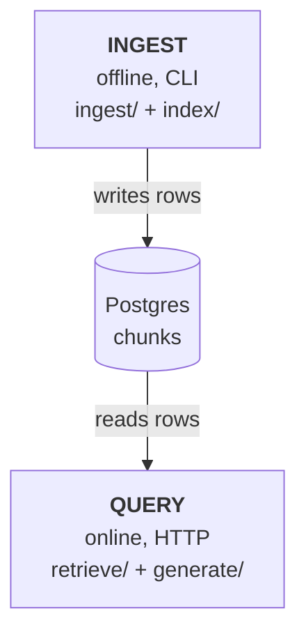
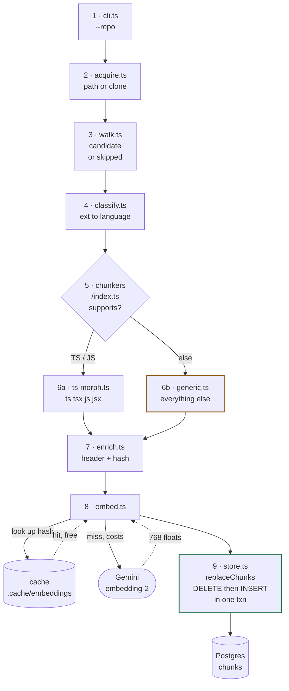
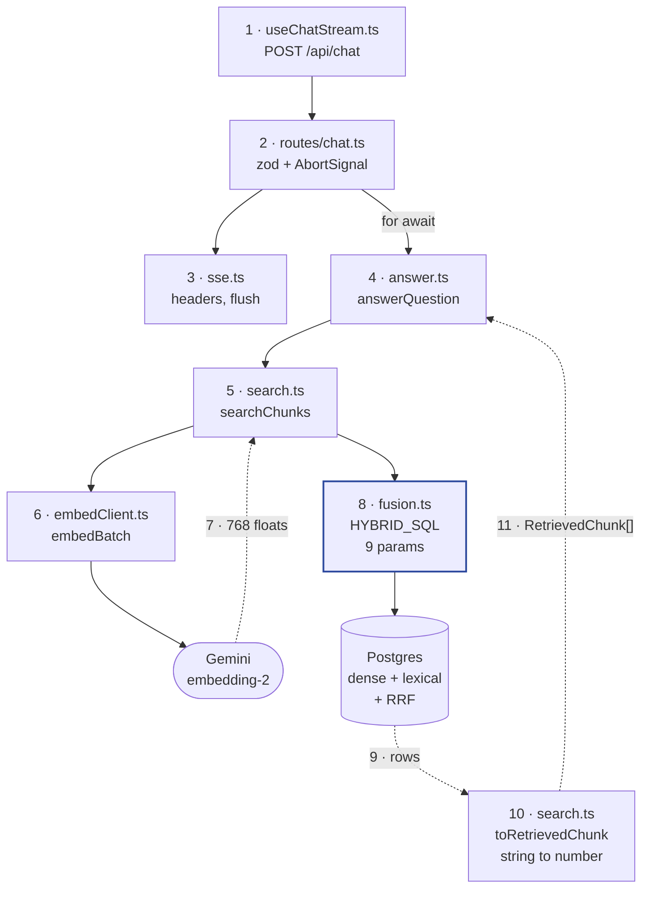
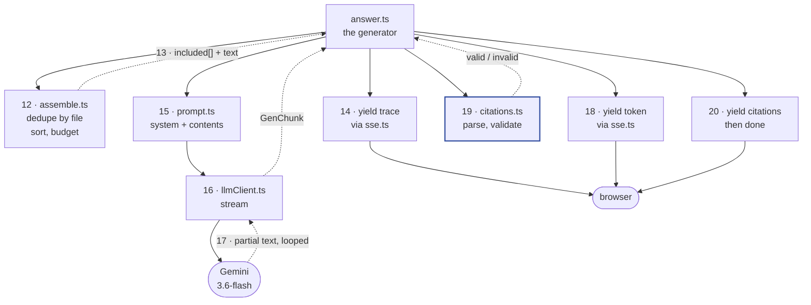
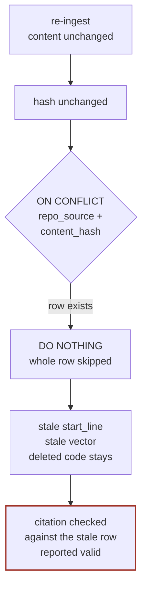
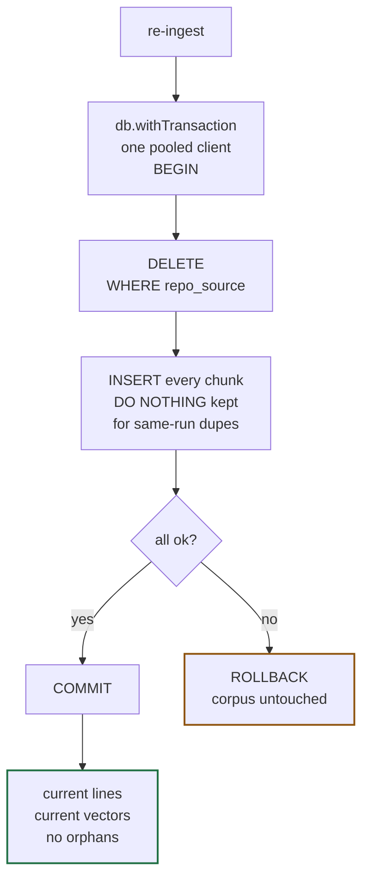

# Flow map — code-doc-assistant

Both pipelines, file by file. Diagrams are Mermaid — they render on GitHub, and in any editor
with a Mermaid-aware Markdown preview.

**Reading the arrows**

```
──▶   solid   = a call going out
┈┈▶   dotted  = a result coming back
1·2·3          = order in time, across all diagrams
◇ = a decision      ⬭ = outside the process
```

---

## A · Two paths, one table

They never import each other. `ts-morph` parsing is synchronous CPU work — in a request handler
it would freeze every open SSE stream, so ingest is a CLI.



---

## B · Ingest — steps 1–9



**Orange — why generic is last.** Its `supports()` returns `true` for everything, same as a 404
handler at the bottom of an Express router. Put it first and `ts-morph` never runs.

**Green — step 9 used to be the one open defect.** It was
`INSERT ... ON CONFLICT (repo_source, content_hash) DO NOTHING`, and the hash excludes
`start_line`. Add an import at the top of a file, everything below shifts, content is unchanged,
hash is unchanged — the database kept the old line numbers, and the citation validator checked
against those same stale numbers, so a wrong citation was reported *valid*. Fixed by Block 9;
before and after in [section G](#g--what-block-9-changed-at-step-9).

---

## C · Query, retrieval half — steps 1–11



---

## D · Query, generation half — steps 12–20



---

## E · The 20 steps as a list

| # | File | What happens |
|---|---|---|
| 1 | `useChatStream.ts:64` | POST with `{ messages, repoSource }` |
| 2 | `routes/chat.ts:47` | zod validates; `AbortSignal.any` of disconnect + 30 s |
| 3 | `sse.ts:36` | headers written and flushed, heartbeat starts |
| 4 | `answer.ts:47` | last `user` message pulled out |
| 5 | `search.ts:79` | hands the question to the embed client |
| 6 | `embedClient.ts` | one call out to Gemini |
| 7 | ◀ back | 768 floats, already L2-normalised |
| 8 | `fusion.ts:36` | nine params, dense + lexical + RRF in one statement |
| 9 | ◀ back | rows, each with a dense rank, a lexical rank, or both |
| 10 | `search.ts:40` | `ROW_NUMBER()` arrives as a string, coerced to number |
| 11 | ◀ back | `RetrievedChunk[]` reaches the generator |
| 12 | `assemble.ts:57` | one chunk per file, sorted, packed to 8000 tokens |
| 13 | ◀ back | included list plus the rendered context text |
| 14 | `answer.ts:93` | `trace` goes out **before** generation starts |
| 15 | `prompt.ts:24` | context attached to the last user turn only |
| 16 | `llmClient.ts` | second call out to Gemini |
| 17 | ◀ back, looped | partial text, once per model chunk |
| 18 | `answer.ts:116` | each piece yielded as a `token` event |
| 19 | `citations.ts:22` | checked against `assembled.included` |
| 20 | `answer.ts:147` | `citations`, then `done` with timings |

---

## F · A real run, one file

Corpus: a single 12-line Express app whose only route is `/health`.
Question: *"how do we know if our app health is ok?"* Real embedding, real Gemini.

```
INGEST
  Files seen: 1 · Chunked: 0 · No declarations: 1
  kind=file  lines=1-13  symbol=NULL  signature=NULL

RETRIEVE                            825 ms
  id   dense  lex   fusedScore   file:lines
  174  1      -     0.016393     server.js:1-13

ANSWER                             5897 ms
  "...it returns a 200 HTTP status with the JSON
   response { status: 'ok' } server.js:6-8."

CITATIONS
  valid    server.js:6-8
```

**No declarations, and nothing lost.** `const app = express()` is not exported and `app.get(...)`
is an expression, not a declaration — so ts-morph found nothing to slice and fell to the whole-file
outcome. The file still got indexed, retrieved, and answered the question.

**The lexical leg returned nothing, for two separate reasons.** First,
`websearch_to_tsquery` ANDs the terms — it produced `'know' & 'app' & 'health' & 'ok'`, and *know*
appears nowhere in the file. Second, and sharper: searching `health` alone still misses, because
Postgres tokenises `/health` as a single *File or path name* lexeme, `'/health'`, which `health`
cannot reach inside. Same shape as `Math.sqrt` becoming a *Host* token. Code is full of strings
Postgres refuses to read as words — that is the concrete argument for keeping a dense leg.

```sql
-- verified
SELECT websearch_to_tsquery('english','how do we know if our app health is ok?');
--   'know' & 'app' & 'health' & 'ok'

SELECT alias, description, token FROM ts_debug('english', $$app.get('/health', req)$$);
--   host       | Host              | app.get
--   file       | File or path name | /health
```

**The citation is narrower than the chunk, and that is fine.** The model cited `server.js:6-8` from
a chunk spanning 1–13. Containment holds — `6 >= 1` and `8 <= 13` — so it validates.
`server.js:99-200` would come back `range-not-retrieved`; `other.js:1-5` would come back
`unknown-file`.

**Why the chunk says 1–13 when the file has 12 lines.** `wholeFileChunks` takes its end from
`sourceFile.getEndLineNumber()` (`ts-morph.ts:501`), and with a trailing newline the file's end
position sits on an empty line past the last statement. Reproduced directly:

```
trailing newline present → 2 lines of content, chunk reports 1-3
trailing newline absent  → 2 lines of content, chunk reports 1-2
```

Nearly every file in a real repo ends with a newline, so **every whole-file chunk over-reports
`end_line` by one.** Scope is narrow — declaration chunks take their bounds from the declaration
itself and are unaffected — but the consequence is real: a citation of `server.js:13` would pass
containment (`13 <= 13`) and point at a line that renders empty. Same family as everything else
here: small, silent, and it lands on the citation guarantee. Still open — deliberately left out of
Block 9, which fixed the store; this one lives in the chunker.

---

## G · What Block 9 changed, at step 9

Step 9 was insert-only. A re-ingest of unchanged content was free, and that property was the point
— but it was bought by skipping the whole row on conflict, including the columns the hash does not
cover.

**Before** — the row is skipped, and nothing anywhere reports it:



**After** — the post-condition is structural, so there is no per-column reasoning to get wrong:



### Before and after, attribute by attribute

| | Before | After |
|---|---|---|
| Statement | `INSERT ... ON CONFLICT DO NOTHING` | `DELETE ... RETURNING id`, then the same INSERT loop |
| Transaction | none — `pool.query('BEGIN')` lands on a different connection and silently does nothing | `db.withTransaction` holds one `pool.connect()` client for the whole step |
| Re-ingest, content unchanged | row skipped entire | row deleted and rewritten |
| `start_line` after a shift above it | stale | current |
| Vector after an embedding-model switch | stale; the new one is billed and discarded | current |
| Code deleted from the repo | row survives and stays retrievable | row gone |
| Failure mid-store | partial writes possible | `ROLLBACK`, corpus exactly as before |
| CLI report | `Upserted: 0` for both "nothing changed" and "everything rejected" | `Deleted: N` and `Inserted: N`, separately |
| `DO NOTHING` | what made re-ingest idempotent | only collapses duplicate hashes inside one run |

### Measured, on `./tmp/mini-demo`

13 chunks, 13/13 cache hits, zero Gemini calls in either run.

```
                        before Block 9        after Block 9
row ids after re-ingest  120-132 unchanged     175-187, all rewritten
CLI                      Upserted: 0           Deleted: 13, Inserted: 13

prepend 2 lines to src/api/client.ts, re-ingest:
  content_hash           5771efb8d3c8          5771efb8d3c8   (unchanged, as expected)
  PricingClient          4-20  (wrong)         6-22  (correct)
```

The hash staying identical while the lines move is the whole point — that is precisely the case
the old path could not see, and the case no error, warning, or metric would have surfaced.
